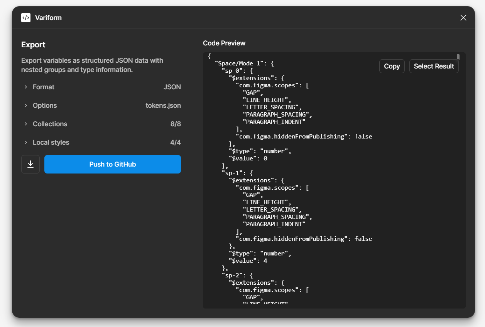
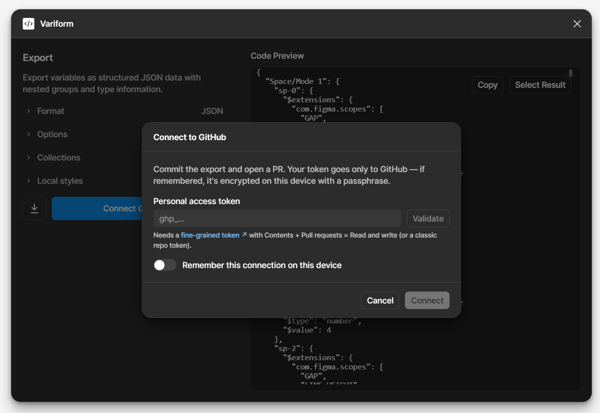
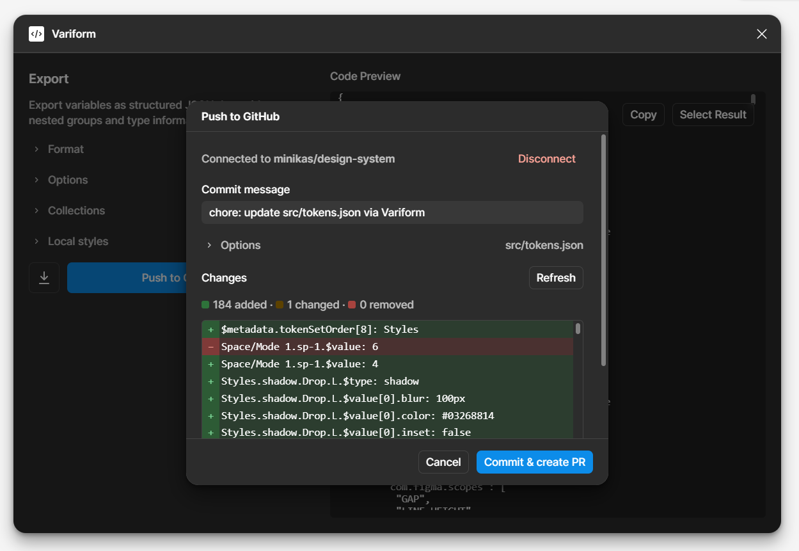
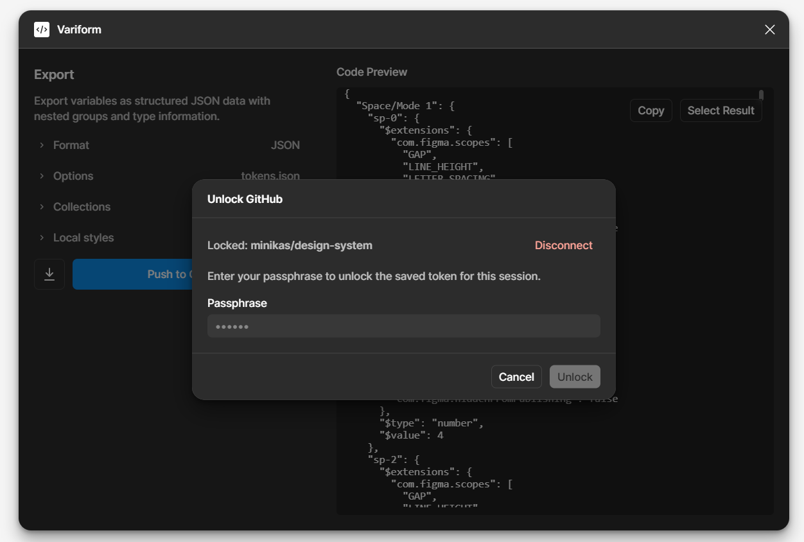

# Variform - Figma Variable Export Plugin

Variform is a Figma plugin that allows you to export your Figma variables **and styles** to JSON, CSV, CSS, or JavaScript formats, making it easier to integrate your design tokens into your development workflow.

Variform is a fork of [VarVar](https://github.com/atropical/varvar) by [Atropical AS](https://atropical.no), extended with GitHub sync, DTCG normalization, local styles export, selective collection/mode export, and an improved UI.



### Screenshots

The GitHub sync flow lives next to the download button in every export view:

| Connect to GitHub | Push to GitHub | Unlock a saved connection |
| --- | --- | --- |
|  |  |  |
| Paste a fine-grained Personal Access Token (Contents + Pull requests = Read and write), **Validate** it, and optionally remember the connection — it's encrypted on-device with a passphrase. | Review a **token-level diff** (added · changed · removed) against the target branch, set the commit message and file path, then **Commit & create PR** without leaving Figma. | When a remembered connection is locked, enter your passphrase to decrypt the saved token for the current session. |

## Features

- **Multiple Export Formats**: Export Figma variables to JSON, CSV, CSS (vanilla or Tailwind CSS v4), or JavaScript
- **Push to GitHub**: Connect a repository, preview a token-level diff, commit on a new branch, and open a pull request — without leaving Figma
- **Refined UI**: Accordion-based selection, live preview with skeleton loading, inspect modals, and inline diff review before pushing
- **Selective Export**: Pick exactly which collections and modes (themes) to export from a real-time accordion — everything is selected by default, and the preview updates as you toggle
- **Styles Export**: Typography, paint (solid/gradient), effect (shadow/blur), and grid styles are exported alongside your variables in the same file (toggleable)
- **DSCG / DTCG Normalization**: Normalize the JSON export to the [Design Tokens (DTCG)](https://tr.designtokens.org/format/) format, preserving Figma scopes and visibility under `$extensions`
- **Format-Specific Menu Commands**: Direct access to each export format from the Figma menu
- **Linked Variable Support**: Identifies and properly handles linked variables across formats
- **Preview & Copy**: Preview exported data and easily copy to clipboard
- **Automatic Downloads**: Exported files are automatically downloaded
- **Row/Column Positioning**: CSV option for spreadsheet formula-like linking

### Linked Variable Handling

- **JSON**: Linked variables start with `$.VARIABLE.PATH`
- **DSCG (DTCG)**: Linked variables become `{Group.path}` references (dot-delimited, e.g. `{Brand.500 - P}`)
- **JavaScript**: Linked variables are referenced directly like `collection.mode.variable`
  - Numeric paths are converted to bracket notation: `collection.mode["500"]`
- **CSV**: Linked variables start with `=VARIABLE/PATH`
  - **Option:** Use row & column positions to produce formula-like linking (i.e. `=E7`) in spreadsheet programs
- **CSS**: Linked variables use CSS custom property syntax: `--var-name: var(--VARIABLE)`
- **Tailwind CSS**: Linked variables use CSS custom property syntax with Tailwind naming conventions

> **Note:** When dealing with linked variables that have multiple modes, the plugin will only link to the first occurrence (i.e., the first mode).

### Modes & Theming

Collections with multiple modes (e.g. a `Colour Primitives` collection with **Light** and **Dark**) are supported across all formats:

- **JSON / JavaScript / CSV / DSCG**: every mode is exported (one object/key/row/token-set per mode).
- **CSS**: modes are mapped to standard theming patterns by name (case-insensitive):
  - `Light`, `Default`, or `Mode 1` → default values in `:root`
  - `Dark` → emitted inside `@media (prefers-color-scheme: dark) { :root { … } }`, so dark values apply automatically
  - any other mode → a `.{collection}--{mode}` theme class you can opt into

```css
:root {
  --brand-500: #043ad1;        /* Light */
}

@media (prefers-color-scheme: dark) {
  :root {
    --brand-500: #6f9bff;      /* Dark */
  }
}
```

### Selecting What to Export

Every export view shows a **Collections & themes** accordion listing each variable collection and its modes (themes):

- **Everything is selected by default** — the plugin behaves exactly as before until you change something.
- **Per-mode selection**: expand a collection and tick/untick individual modes (themes). The collection's checkbox is tri-state (all / some / none).
- **Per-collection selection**: tick the collection header to toggle all of its modes at once; use **All** / **None** to (de)select every collection.
- **Local styles**: four checkboxes (text, paint, effect, grid) control which kinds of local Figma styles are appended (hidden for the DSCG export, which is variables-only).
- **Real-time preview**: the output regenerates as you toggle (debounced), so the preview always reflects the current selection.
- **Remembered per file**: your selection is saved per document via the plugin's client storage, and reconciled against the current collections the next time you open the file (new collections default to selected; deleted ones are dropped).

> **Note:** A linked variable can reference a token in a collection/mode you did not select. In that case the reference is kept as text (it points outside the exported subset). For the CSV row/column option, a deselected target falls back to a readable `=Collection/Mode/Variable` reference instead of a dangling cell.

### Inspecting Contents

Next to each collection (and the **Local styles** section) there is a small **inspect** button. Clicking it opens a modal with a table of that item's contents, so you can see what you're about to export at a glance:

- **Collections** — one row per variable, with columns for the name, type, the resolved value in **each mode**, and the description (aliases are shown as `→ Linked/Variable`).
- **Local styles** — one row per style, with its name, kind (text/paint/effect/grid), value, and description.

The data is fetched on demand from the document, so the table always reflects the current variables/styles.

### Description Parsers

A **Description parser** select lets you transform each variable's `description` before export. The parser is applied to the formats that emit the description as data — **JSON**, **JavaScript** and **CSV** (the choice is shared across views and remembered per file):

- **None (plain string)** — default; the description is exported verbatim as a string.
- **Description to JSON** — if you author JSON in a variable's description (e.g. `{"id":"testando"}`), it is parsed and emitted as a real JSON object/array. Invalid JSON falls back to the original string, and an empty description becomes `""`.

Parsers are defined in a small registry (`src/utils/descriptionParsers.ts`); adding a new one is just appending an entry with an `id`, `name` and `parse(raw)` function — the select, message plumbing and exporters pick it up automatically.

### Styles Export

Every export includes your local Figma styles together with the variables — no extra step or separate command (unless you turn the **Local styles** toggles off in the selection accordion). When a file has no local styles, the output is identical to a variables-only export.

| Figma style | What gets exported | CSS / Tailwind mapping |
| --- | --- | --- |
| **Text styles** | font family, size, weight, line-height, letter-spacing, case, decoration | CSS utility classes / Tailwind `--text-*` tokens (with `--line-height`, `--font-weight` modifiers) |
| **Paint styles** | solid colors and linear/radial/angular gradients | `:root` custom properties / Tailwind `--color-*` (solids) and `--gradient-*` (gradients) |
| **Effect styles** | drop & inner shadows, layer & background blur | `box-shadow`, `filter`, `backdrop-filter` custom properties / Tailwind `--shadow-*` |
| **Grid styles** | column/row/grid layout summary | documented in a comment block (no native CSS equivalent) |

In **JSON** and **JavaScript**, styles are emitted as a design-token tree grouped into `textStyles`, `paintStyles`, `effectStyles`, and `gridStyles`. In **CSV**, each style is appended as a row using the same `Collection,Mode,Variable,Type,Value,Scopes,Description` schema as variables.

> **Note:** Gradient angles are derived from Figma's gradient transform assuming a square aspect ratio. The `DIAMOND` gradient type has no CSS equivalent and is approximated with a radial gradient. (The DSCG normalization is variables-only — see the note below.)

## Installation

1. Open Figma and go to the Community tab
2. Search for "Variform"
3. Click on the plugin and then click "Install"

## Usage

### Quick Export (Format-Specific)

Access format-specific exports directly from the Figma menu:

1. Open your Figma file containing variables
2. Go to **Plugins** → **Variform** → Choose your format:
   - **Export as JSON** - Structured JSON data with nested groups
     - *Normalize to DSCG* - Toggle to emit the DTCG token format instead of the default JSON shape
   - **Export as JavaScript** - JavaScript objects with proper references
   - **Export as CSV** - Spreadsheet-compatible data
   - **Export as CSS** - CSS custom properties for web development
     - *Tailwind CSS or vanilla* - Tailwind CSS format with `@theme` directive (BETA)
3. Configure filename and options (if applicable)
4. Click "Export Variables"
5. The exported file will be automatically downloaded

### Generic Export

For format selection within the interface:

1. Open your Figma file containing variables
2. Go to **Plugins** → **Variform** → **Export Variables**
3. Choose your desired export format
4. Configure filename and options
5. Click "Export Variables"
6. The exported file will be automatically downloaded

### Preview and Copy

- Toggle the "Preview output" switch to see the exported data within the plugin interface
- Use the "Select to Copy" button and copy (Ctrl/Cmd + C) the exported data to your clipboard

> **Note:** Programmatically copying is currently not supported by Figma Plugin APIs.

### Push to GitHub

Every export view includes **Connect GitHub…** / **Push to GitHub** next to the download button (enabled once output has been generated):

1. **Connect** — enter a [GitHub Personal Access Token](https://github.com/settings/personal-access-tokens/new) with `contents` and `pull_requests` access (or classic `repo` scope). Pick a repository and base branch from searchable lists. GitHub Enterprise is supported via a custom API base URL.
2. **Remember (optional)** — store the connection in Figma client storage. The token is encrypted with a passphrase you choose (AES-256-GCM) and must be unlocked each session.
3. **Configure the push** — set the repository file path (remembered per document), target branch (defaults to `variform/<filename>-<suffix>`), commit message, and pull request title/body.
4. **Review the diff** — **Refresh** compares the new export against the file already on the target branch (or the base branch when the target branch does not exist yet). JSON/DSCG and CSS use token-level diffs; CSV and JavaScript fall back to line diffs.
5. **Push** — creates the branch when needed, commits the file, and opens a pull request automatically. If PR creation fails (e.g. one already exists), a compare URL is provided as a fallback.

> **Security:** Your token is sent only to the configured GitHub host over HTTPS. It is never logged or embedded in exported files.

## DSCG / DTCG Format

When the **Normalize to DSCG** option is enabled for the JSON export, variables are emitted in the [Design Tokens (DTCG)](https://tr.designtokens.org/format/) format, so they can be imported directly as a token set.

Normalization rules:

- Each **collection + mode** pair becomes a top-level token set named `"${collection}/${mode}"`.
- Variables are nested by their `/`-delimited name. Each leaf carries `$extensions`, `$type` and `$value` (in that order), matching the DTCG export.
- `$extensions` holds `com.figma.scopes` (only when the variable has scopes) followed by `com.figma.hiddenFromPublishing`.
- `$type` is mapped from the Figma resolved type: `COLOR → color`, `FLOAT → number`, `STRING → text`, `BOOLEAN → boolean`.
- Colors are output as hex, with an 8-digit `#rrggbbaa` value when not fully opaque.
- Linked variables become `{Group.path}` references (e.g. `{Brand.500 - P}`).
- The file ends with `$themes` and `$metadata.tokenSetOrder` so the consuming tool can resolve set ordering.

Example output:

```json
{
  "Colour Primitives/Light": {
    "Brand": {
      "500 - P": {
        "$extensions": { "com.figma.hiddenFromPublishing": false },
        "$type": "color",
        "$value": "#043ad1"
      }
    }
  },
  "Colour Usage/Mode 1": {
    "Background": {
      "Brand": {
        "Bold_01": {
          "$extensions": {
            "com.figma.scopes": ["FRAME_FILL", "SHAPE_FILL"],
            "com.figma.hiddenFromPublishing": false
          },
          "$type": "color",
          "$value": "{Brand.500 - P}"
        }
      }
    }
  },
  "Space/Mode 1": {
    "sp-5": {
      "$extensions": {
        "com.figma.scopes": ["GAP", "LINE_HEIGHT"],
        "com.figma.hiddenFromPublishing": false
      },
      "$type": "number",
      "$value": 16
    }
  },
  "$themes": [],
  "$metadata": {
    "tokenSetOrder": [
      "Colour Primitives/Light",
      "Colour Usage/Mode 1",
      "Space/Mode 1"
    ]
  }
}
```

> **Note:** DSCG normalizes variable collections only (it does not include local paint, text, or effect styles).

## Architecture

Variform is built with a modular architecture for maintainability and scalability:

### Core Components

- **Type System**: Strict TypeScript enums and interfaces for type safety
- **UI Components**: Reusable React components for consistent interface
- **Format Views**: Dedicated views for each export format
- **Export Utilities**: Format-specific processing functions with JSDoc documentation

### File Structure

```
src/
├── components/          # Reusable UI components
│   ├── github/              # GitHub connect / push / diff UI
│   │   ├── GitHubButton.tsx
│   │   ├── GitHubDialog.tsx
│   │   └── DiffList.tsx
│   ├── PluginDialogShell.tsx  # Layout shell with padding and footer
│   ├── ExportHeader.tsx
│   ├── ExportLayout.tsx
│   ├── ExportActions.tsx      # Download + GitHub push actions
│   ├── FilenameInput.tsx
│   ├── ExportButton.tsx
│   ├── OutputPreview.tsx
│   ├── ExportOptions.tsx
│   ├── CollectionAccordion.tsx  # Collections & themes selection accordion
│   ├── SectionAccordion.tsx
│   ├── InspectButton.tsx
│   ├── InspectDialog.tsx
│   ├── ParserSelect.tsx
│   ├── PreviewSkeleton.tsx
│   └── Footer.tsx
├── contexts/           # React context providers
│   ├── SelectionContext.tsx  # Export selection state (shared across views, persisted)
│   └── InspectContext.tsx
├── hooks/              # Custom React hooks
│   ├── useExportData.ts    # Hook for managing export data and state
│   ├── useGitHub.ts        # GitHub connect / push / diff orchestration
│   └── useClientStorage.ts
├── views/              # Format-specific export views
│   ├── ExportView.tsx      # Generic export with format selector
│   ├── ExportJSON.tsx
│   ├── ExportCSV.tsx
│   ├── ExportCSS.tsx
│   └── ExportJS.tsx
├── utils/              # Export processing utilities
│   ├── github/                # GitHub REST client, diff, crypto, branch naming
│   │   ├── githubApi.ts
│   │   ├── tokenDiff.ts
│   │   ├── crypto.ts
│   │   └── branchName.ts
│   ├── collectionToJSON.ts
│   ├── collectionToDSCG.ts    # DSCG / DTCG normalization
│   ├── collectionToCSV.ts
│   ├── collectionToCSS.ts
│   ├── collectionToJS.ts
│   ├── collectionToTailwind.ts
│   ├── descriptionParsers.ts
│   ├── selectionUtils.ts      # Filters collections/modes by the export selection
│   ├── selectionState.ts      # Pure selection reducers (toggle, tri-state, reconcile)
│   ├── styleConversion.ts     # Pure Figma-style → CSS conversion helpers
│   ├── styleSerializers.ts    # Style extraction + per-format fragment producers
│   ├── styleSelection.ts
│   ├── clipboard.ts
│   ├── color.ts
│   └── stringTransformation.ts
├── types.d.ts          # TypeScript definitions and enums
├── code.ts             # Plugin main logic
└── ui.tsx              # UI router and main app
```

## Development

To set up the development environment:

1. Clone the repository:
   ```
   git clone https://github.com/minikas/Variform.git
   cd Variform
   ```
2. Install dependencies:
   ```
   npm install
   ```
3. Run the development server:
   ```
   npm run dev
   ```

### Building the Plugin

To build the plugin for production:
```
npm run build
```

### Testing

Unit tests for the style-conversion, DSCG, GitHub, and export-selection logic run with [Vitest](https://vitest.dev):
```
npm run test:unit     # run once
npm run test:watch    # watch mode
```
The `npm test` script type-checks and builds the plugin.

## License

Variform is licensed under the [GNU General Public License v3.0](LICENSE) (GPL-3.0-only), the same license as the upstream [VarVar](https://github.com/atropical/varvar) project.

## Acknowledgements

Variform is based on [VarVar](https://github.com/atropical/varvar) by [Atropical AS](https://atropical.no). Original export logic and formats are © Atropical AS; modifications and new features (GitHub sync, DTCG, local styles, selective export, UI) are © Kas.

## Author

Variform is maintained by [Kas](https://github.com/minikas). Upstream VarVar is developed by [Atropical AS](https://atropical.no).